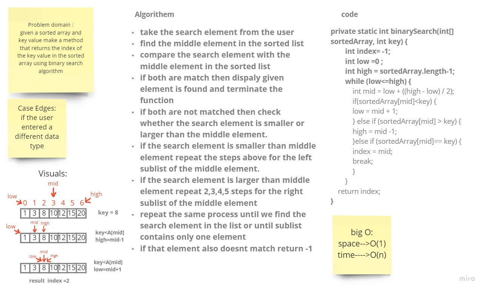

# Binary Search of Sorted Array
Given a sorted array arr[] of n elements, write a function to search a given element x in arr[].

## Whiteboard Process

## Approach & Efficiency
calculate the middel of array by ceil of divided length of array by 2
create new array with size equal the size of origin array plus 1
copy the items from 0 to middel-1 to new array
let the middel of new array equal the value
coppy items from middel to end of origin array to middel plus one to end of new array
Big O of time is O(n) and space is O(1)