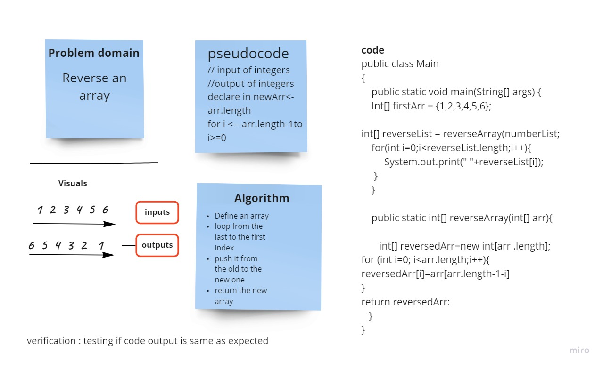

# Reverse an Array
Write a function called reverseArray which takes an array as an argument. 

## Whiteboard Process

## Approach & Efficiency
Looping through the array once to push elements to the new array.